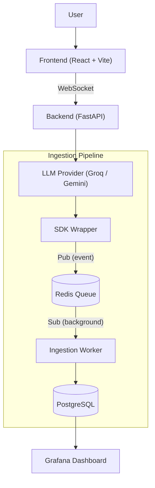

# Brank Chatbot Observability Assignment

A full-stack, event-driven AI chatbot with real-time telemetry, PII redaction, and a lightweight ingestion pipeline for logging inference metadata.

## Table of Contents

- [Architecture Overview](#architecture-overview)
- [Tech Stack](#tech-stack)
- [Key Features](#key-features)
- [Getting Started](#getting-started)
- [Environment Variables](#environment-variables)
- [Database Schema](#database-schema)
- [Architecture Notes](#architecture-notes)
- [Tradeoffs](#tradeoffs)
- [What I'd Improve With More Time](#what-id-improve-with-more-time)
<!-- - [Demo](#demo) -->

## Architecture Overview

The system decouples chat processing from telemetry ingestion so database I/O never blocks the user-facing chat experience. Every LLM call is wrapped by a lightweight SDK that emits a structured event to Redis; a background worker consumes that event and persists it to PostgreSQL, which Grafana then reads for dashboards.



1. **Frontend (React + Vite)** — chat UI that talks to the backend over WebSockets for real-time, streaming responses.
2. **Backend (FastAPI)** — owns the WebSocket connection and routes each request to the selected LLM provider through a factory pattern.
3. **Ingestion Pipeline**
   - **SDK / Wrapper** — wraps every LLM call, times it, extracts token usage, redacts PII, and publishes an event to Redis.
   - **Worker** — a background subscriber that consumes events off Redis and writes them to PostgreSQL asynchronously, so ingestion never adds latency to the chat response.
4. **Observability** — Grafana reads from PostgreSQL to show latency, throughput, and error-rate dashboards in real time.

## Tech Stack

| Layer | Technology |
|---|---|
| Frontend | React, Vite |
| Backend | FastAPI (Python), WebSockets |
| LLM Providers | Groq, Gemini (factory pattern, pluggable) |
| Queue | Redis (Pub/Sub) |
| Database | PostgreSQL |
| Dashboards | Grafana |
| Deployment | Docker Compose |

## Key Features

- **Multi-turn conversations** — the backend keeps short conversational context per session.
- **Streaming responses** — answers stream to the UI over WebSockets as they're generated.
- **Multi-provider support** — Groq and Gemini sit behind a common interface; adding a new provider means adding a new factory implementation, not touching the chat flow.
- **Event-based ingestion** — telemetry is published to Redis and processed off the request path, so a slow database never slows down a chat reply.
- **PII redaction** — input/output previews are redacted before they're persisted, so raw sensitive data doesn't sit in the logs.
- **Conversation management** — conversations can be listed, resumed, and cancelled from the UI.
- **Real-time observability** — a Grafana dashboard tracks latency, throughput, and error rate against live data in PostgreSQL.
- **One-command deployment** — the full stack (frontend, backend, worker, Redis, Postgres, Grafana) starts with a single `docker compose up`.

## Getting Started

### Prerequisites

- Docker and Docker Compose installed
- A [Groq](https://console.groq.com) API key and a [Gemini](https://ai.google.dev/) API key

### Setup

1. **Clone the repository**

   ```bash
   git clone https://github.com/Sagar2inf/brank_chatbot.git
   cd brank_chatbot
   ```

2. **Add your API keys** — create a `.env` file in the project root (see [Environment Variables](#environment-variables))

3. **Build and start everything**

   ```bash
   docker compose up --build -d
   ```

Once the containers are up:

| Service | URL | Login |
|---|---|---|
| Chatbot UI | http://localhost | — |
| Grafana Dashboard | http://localhost:3000 | `admin` / `admin` |

## Environment Variables

| Variable | Description |
|---|---|
| `GROQ_API_KEY` | API key for the Groq provider |
| `GEMINI_API_KEY` | API key for the Gemini provider |

```env
GROQ_API_KEY=your_key_here
GEMINI_API_KEY=your_key_here
```

## Database Schema

The schema splits chat data from telemetry data, since they have different reliability requirements: conversation history needs to be there when the user hits "resume," while telemetry can tolerate the occasional lost event.

**`conversations`**

| Column | Type | Notes |
|---|---|---|
| `id` | UUID (PK) | |
| `title` | text, nullable | derived from the first user message |
| `status` | enum: `active`, `cancelled`, `completed` | backs the list / resume / cancel UI |
| `created_at` | timestamptz | |
| `updated_at` | timestamptz | |

**`messages`**

| Column | Type | Notes |
|---|---|---|
| `id` | UUID (PK) | |
| `conversation_id` | UUID (FK → conversations.id) | |
| `role` | enum: `user`, `assistant`, `system` | |
| `content` | text | full message content |
| `created_at` | timestamptz | used to order messages within a conversation |

**`inference_logs`**

| Column | Type | Notes |
|---|---|---|
| `id` | UUID (PK) | |
| `conversation_id` | UUID (FK → conversations.id) | |
| `message_id` | UUID (FK → messages.id), nullable | which assistant reply this call produced |
| `provider` | text | `groq` / `gemini` |
| `model` | text | |
| `latency_ms` | integer | |
| `prompt_tokens` | integer | |
| `completion_tokens` | integer | |
| `total_tokens` | integer | |
| `status` | enum: `success`, `error` | |
| `error_message` | text, nullable | |
| `input_preview` | text | redacted, truncated |
| `output_preview` | text | redacted, truncated |
| `created_at` | timestamptz | |

**Why this split:**
- `messages` holds the actual conversation, so the UI can always list and resume a chat even if the telemetry pipeline is behind.
- `inference_logs` is written only by the worker and is append-only, so it can be replayed or dropped without touching the conversation itself.
- Previews rather than full payloads are stored in `inference_logs`, keeping rows small and limiting how much sensitive text is retained.

## Architecture Notes

**Ingestion flow**
1. The frontend opens a WebSocket to FastAPI and sends a user message.
2. FastAPI persists the message to `messages` and calls the selected provider (Groq or Gemini) through the SDK wrapper.
3. The wrapper times the call, reads token usage off the provider response, and redacts any PII in the input/output before building a log event.
4. The event is published to a Redis Pub/Sub channel — this call returns immediately, so the user's response is never delayed by logging.
5. A background worker subscribed to that channel picks up the event, validates the payload, and writes it to `inference_logs`.
6. Grafana queries PostgreSQL directly to render latency, throughput, and error-rate panels.

**Logging strategy**
- Every event is a structured JSON payload rather than free text, so the worker can validate and parse it without regex.
- PII redaction happens in the SDK, before the event ever reaches Redis, so raw sensitive data never leaves the request process.
- Only bounded-length previews of input/output are persisted — full payloads are not stored.
- Every event carries the conversation/session ID so logs can be correlated back to a specific chat.

**Scaling considerations**
- Because ingestion is decoupled via Redis, the chat path stays fast even if PostgreSQL is under load or briefly unavailable.
- The worker is stateless and can be scaled horizontally; moving from plain Pub/Sub to Redis Streams with consumer groups would let multiple worker replicas share the load without double-processing events.
- Ingestion writes and Grafana's read queries currently share one PostgreSQL instance; a read replica would isolate dashboard queries from the ingestion path at higher volume.

**Failure handling assumptions**
- Chat messages are written directly by FastAPI, so conversation history stays available even if Redis or the worker is down.
- Telemetry is treated as best-effort: Redis Pub/Sub doesn't persist events for subscribers that aren't listening, so an event published while the worker is down is lost. That's an acceptable tradeoff for observability data, but it would need Redis Streams (or a durable broker) if telemetry had to be lossless.
- If a provider call fails (timeout, rate limit, error response), the wrapper still emits a log event with `status = error` and an `error_message`, so failures show up on the dashboard instead of disappearing silently.

## Tradeoffs

- **Redis Pub/Sub vs. a durable queue** — Pub/Sub is simple to run and enough for this scope, but it has no persistence: if the worker isn't listening, the event is gone. Redis Streams or Kafka would trade setup complexity for guaranteed delivery.
- **Previews vs. full payloads** — storing truncated, redacted previews instead of full request/response bodies keeps the database small and limits sensitive data at rest, at the cost of not being able to fully replay a call from the logs alone.
- **One PostgreSQL instance for chat and telemetry** — the simplest option at this scope, but ingestion writes and dashboard reads will start competing for the same resources at real production volume.
- **WebSockets for streaming** — a much better chat UX than polling, at the cost of extra connection-state handling (reconnects, dropped connections) on both ends.
- **Factory pattern for providers** — a small extra layer of indirection over calling Groq/Gemini directly, in exchange for adding a new provider without touching the chat flow.

## What I'd Improve With More Time

- Move from Redis Pub/Sub to Redis Streams (or Kafka) so ingestion events survive a worker restart and can be replayed.
- Add retry and dead-letter handling in the worker for events that fail to parse or fail to write to PostgreSQL.
- Add authentication so conversations are scoped to a user instead of being globally visible.
- Add automated tests — unit tests for the SDK wrapper/redaction logic, integration tests for the ingestion pipeline.
- Set up CI/CD and deploy the stack to a self-hosted Kubernetes cluster.
- Add alerting on top of the Grafana dashboards (e.g., page on error-rate spikes) instead of dashboards-only observability.

<!-- ## Demo -->

<!-- - **Hosted link:** _add link here_
- **Screenshots / Loom walkthrough:** _add link here_ -->